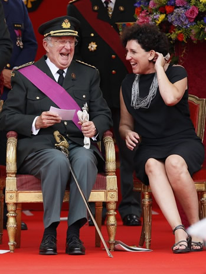
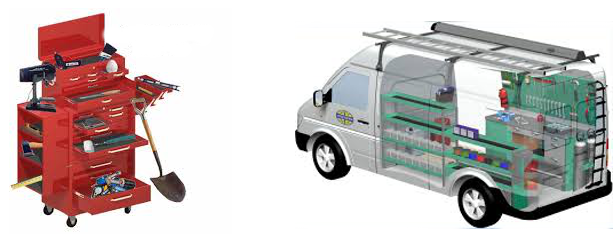
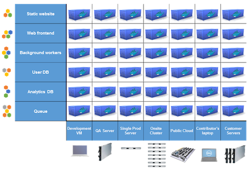
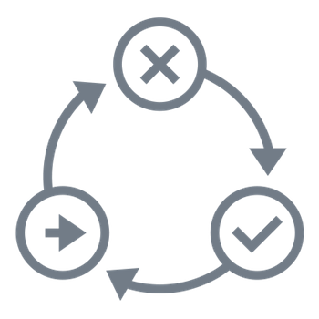
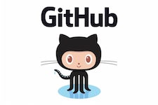
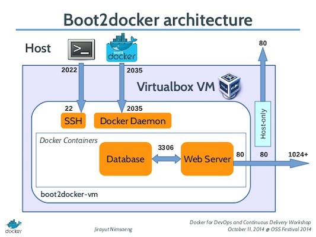
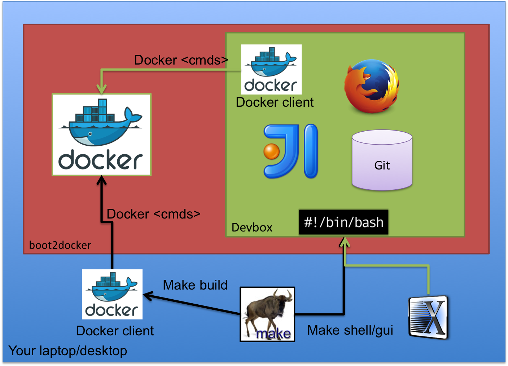

title: devbox
name: inverse
layout: true
class: center, middle, inverse
---
# Devbox in Docker

---
layout:false

# Agenda :

1. Introduction
2. Pourquoi ce talk ?
3. "Full stack" Engineer
4. Demo time !

???
(jmm)

---
template: inverse

# Introduction

???
(jmm)
---

layout: false
.left-column[
# Intro
  ## Qui sommes-nous ?
]
.right-column[

# Nous venons de Belgique

]
???
Jmm

---
layout: false
.left-column[
# Intro
  ## Qui sommes-nous ?
]
.right-column[

  # Nous venons de Belgique

  &nbsp;

  **Le pays du chocolat...**

.center[]

]
???
Jmm

---
layout: false
.left-column[
# Intro
  ## Qui sommes-nous ?
]
.right-column[

  # Nous venons de Belgique

  &nbsp;

  **Le pays de la bière...**


.center[]


]

???
Jmm

---
layout: false
.left-column[
# Intro
  ## Qui sommes-nous ?
]
.right-column[

  # Nous venons de Belgique

  &nbsp;

  **Le pays où on ne se prend pas (trop) au sérieux...**


.center[]


]
???
Jmm

---
layout: false
.left-column[
# Intro
  ## Qui sommes-nous ?
]
.right-column[

  # Nous venons de Belgique

  &nbsp;

  **Le pays où on tourne en rond ?**


.center[]

]
???
Jmm

---
layout: false
.left-column[
# Intro
  ## Qui sommes-nous ?
]
.right-column[
  # Jean-Marc MEESSEN

  Vous pourriez  me retrouver dans un surgelateur de grande surface

  .center[]

  * Senior developer @ Worldline, newcomer coach, development infrastructure

  * Developement Middleware sur Fuse / ServiceMix / Camel

  * Trop timide pour participer activement à des projets Open Source. Quelques contributions à Asciidoctor et Freeplane.

  * `jean-marc@meessen-web.org`, `@JM_Meessen`

]

???
jmm

---

layout: false
.left-column[
# Intro
  ## Qui sommes-nous ?
]
.right-column[
# Damien DUPORTAL

.center[]

* DevOps Engineer @ Worldline

* Grimpeur
* Français émigré en Belgique
* Enseignant la HA et les SIGs (ENSG, EPSI)

* Contact :
  * Gmail : `damien.duportal@gmail.com`
  * Twitter : [@DamienDuportal](https://twitter.com/DamienDuportal)
  * Github : [dduportal](https://github.com/dduportal)


]

???
Damien

---
layout: false
.left-column[
# Intro
  ## Qui sommes-nous ?
  ## Remerciements
]
.right-column[
  # Merci !

  * Organisateurs et bénévoles Mix-It 

  * à vous, de venir !

  * Aux personnes ayant réalisé et crus en ces outils
]

???
Damien

---
layout: false
.left-column[
# Intro
  ## Qui sommes-nous ?
  ## Remerciements
  ## Et vous ?
]
.right-column[
  # Faisons connaissance...

  * Des devs ? Des Ops ? Des chefs ? Autre ?

  * Des seniors (des vrais) ? Des moins seniors ? Des juniors ?

  * Expérience avec la virtualisation ?

  * Vous souvenez-vous de votre premier emploi ?
]

???
(jmm)

---
template: inverse

# Pourquoi ce talk ?

???
jmm

---
layout: false
.left-column[
# Pourquoi ce talk ?
]
.right-column[
  # Pourquoi ce talk ?
  * J'ai participé à beaucoup d'aventures ces 30 dernières années.

  * Toujours aussi enthousiaste pour apprendre et partager
  
  * MAIS, une de mes grandes frustrations : La perte de temps et d'énergie au démarrage de chaque nouvelle aventure.
]
???
jmm

"30 dernieres années" : 
  * aventures informatiques
  * au moins pour Jmm
  * beaucoup de belles victoires, des échecs...
  * des "jerks", mais surtout des gens géniaux

## enthousiastes
* admiratif des choses extraordinaires qu'il y "là dehors" 
* rendre la vie des gens plus facile et agréable
* Je suis fier de ce que je fais et je veux le partager (ex: new comers)
* J'espère pouvoir continuer à être enthousiaste et partageur au dela de ma penssion

---
layout: false
.left-column[
# Pourquoi ce talk ?
  ## Quel est le problème ?
]
.right-column[

# Quel est le problème ?

* Gaspillage d'énergie au mauvais moment

* Mise en place de l'environement coûteuse :

.left[]

* coût de maintenance

* "Nivellement par le bas"

## Objectif : 
Devbox *très* rapide à déployer et du premier coup
]

???
  jmm

  * perte du focus
  * et je ne parle pas de l'env d'integration
  * Maintenance et maJ : montée de version  de IDE / JDK / etc.
  * Coût : comment le mesurer pour l'anticiper voire le diminuer 

---
layout: false
.left-column[
# Pourquoi ce talk ?
  ## Quel est le problème ?
  ## Solutions ?
]
.right-column[
  # Solutions "d'avant"

  * les terminaux sur le mainframe

  * les PC avec images (quid des utilisateurs nomades ?)

  * virtualisation avec Vagrant/VB par ex

]

???
jmm

---
layout: false
.left-column[
# Pourquoi ce talk ?
  ## Quel est le problème ?
  ## Solutions ?
  ## Constat
]
.right-column[
# Constat

* DEVBOX = TOOLBOX = Trousse à outils = Camion atelier

.center[]

* Même problèmes que pour nos applications, donc mêmes solutions :
  * DaaT : Devbox as a Tool (comme avant)
  * DaaS : Devbox as a Software
  * DaaI : Devbox as an Infrastructure
  * DaaLt :Devbox as a Learning tool

]

???
jmm

---
layout: false
.left-column[
# Pourquoi ce talk ?
  ## Quel est le problème ?
  ## Solutions ?
  ## Constat
  ## Docker !
]
.right-column[
  # Docker !

  * Docker résouds le pb de "Matrix of hell"
  * Docker contractualise
  * Docker est rapide
  * Docker est "à la mode"
  * Permet de nouveaux produits/solutions
    * Souvenez vous de la "libération" du GPS par B. Clinton

.center[]

]
???
ddu

---

template: inverse


# Utiliser les recettes de l'ingénierie logicielle 
## Nous sommes TOUS des ingénieurs "Full stack"


---
layout: false
.left-column[
# "Full stack" Engineer
  ## Code == Valeur

]
.right-column[
  # "La vérité est dans le code"
  (http://programming-motherfucker.com)

  Utilisez des SCMs, si possible des DVCS => nouvelles façons de travailler :

  .center[]
]

---
layout: false
.left-column[
# "Full stack" Engineer
  ## Code == Valeur
  ## Nouvelles pratiques

]
.right-column[
  # "Nouvelles" pratiques

  N'ayons pas peur d'_essayer,_ **plusieurs fois,** toutes ces nouvelles façons de faire, sans être dogmatiques

  * Agile
  * TDD/BDD/Doc. as code
  * DevOps


  .center[]
]

---
layout: false
.left-column[
# "Full stack" Engineer
  ## Code == Valeur
  ## Nouvelles pratiques
  ## Continous*
]
.right-column[
  # Continous*

  * Continous Integration
  * Continuous Testing (TDD right ?)
  * Cotinuous documentation
  * Continuous Benchmarking
  * Continuous delivery

.center[]
 
]

---
layout: false
.left-column[
# "Full stack" Engineer
  ## Code == Valeur
  ## Nouvelles pratiques
  ## Continous*
  ## "Human Stack"
]
.right-column[

# "Human stack" 

.center[
## Culture

## Confiance

]
* "Compagnonnage" 
* Eat your own dog food

 
]

---
template: inverse

# Démo Time !

???
jmm
---
layout: false
.left-column[
# Démo Time !
]
.right-column[
# Démo Time !

* Objet : Spring boot "hello world" application

* Java DK, Maven, IntelliJ Idea, Docker, Compose

* Open and reusable code : [https://github.com/jmMeessen/devbox](https://github.com/jmMeessen/devbox)

* Use cases :
  * Onboarding
  * Developement simple basé sur Spring Boot
  * MaJ IDEA sans casser le dev workflow
  * Portabilité
  * Legacy (Lon living applications)
]
???
jmm

---
layout: false
.left-column[
# Démo Time !
  ## Devbox as a code
]
.right-column[
  # SCM :Git (on Github)

  * Public

  * Partagé

  * Pull-Request systématique (Github workflow)

.center[]
.center[]

 
]
???
jmm

---
layout: false
.left-column[
# Démo Time !
  ## Devbox as a code
]
.right-column[
  # TDD/BDD

  Utilisation de [Bats](https://github.com/sstephenson/bats) (testing en bash) au maximum

```shell
@test "Check JDK presence" {
  docker run --user "dockerx" which java
}
```

  * Test Driven Developemt (BDD) oriented
  * Basé sur Bash : compromis "démarrage rapide" vs. maintenabilité
  * Objectif pour une fonctionnalité : 
    * Rouge : Rédaction des tests qui vont être "fail" 
    * Green : Implémentation, c'est OK 
  * Pragmatisme : ne pas tout tester non plus, par petits pas !


Lancement facile :
```bash
$ make test
```

]
???
jmm

---
layout: false
.left-column[
# Démo Time !
  ## Devbox as a code
]
.right-column[
  # Continuous*

  Utilisation de [CircleCI](https://circleci.com) :

  * Basé sur les hooks Github (git push == build)
  * Support de Docker
  * Configuration as a code :

```yaml
circle.yml:

machine:
    services:
    - docker
dependencies:
  override:
    - make build
test:
  override:
    - make test
```
 
]
???
jmm

---
layout: false
.left-column[
# Démo Time !
  ## Devbox as a code
]
.right-column[
# Docker stack

Utilisation de [boot2docker](https://boot2docker.io) :
* Multi-plateforme (virtualbox)
* Support officiel de Docker

.center[]

]
???
jmm

---
layout: false
.left-column[
# Démo Time !
  ## Devbox as a code
]
.right-column[
  # Cinématique

  Utilisation de [GNU Make](https://www.gnu.org/software/make/) :
  * Indépendance cinématique / outils (On peut s'affranchir de Docker)
  * Multi-platforme

```bash
Makefile:

all: build test

build:
  ...
start:
  ...
test:
  ...
backup:
  ...
clean:
  ...
```
 
]
???
jmm

---
layout: false
.left-column[
# Démo Time !
  ## Devbox as a code
]
.right-column[
# Demo 1 : 

.center[]
 
]
???
jmm

---
template: inverse

# Demo 1

See code on Github :

[https://github.com/jmMeessen/devbox/tree/Demo1](https://github.com/jmMeessen/devbox/tree/Demo1)

???
jmm

---
layout: false
.left-column[
# Démo Time !
  ## Devbox as a code
  ## Devbox as an infrastructure
]
.right-column[

# Données

  * Comment conserver ses données si on détruit/met à jour la VM ?
  * Comment sauvegarder ses données ?

# Réseau 

  * Travailleurs nomades, pauvres employé de SSI...
  * Ressources locales : cache proxy, registre docker, cache Maven ?
 
]

---
layout: false
.left-column[
# Démo Time !
  ## Devbox as a code
  ## Devbox as an infrastructure
]
.right-column[
  # Devbox as an infrastructure

  Solution : Docker-compose (Was known as Fig) ! 

```yaml
web:
  image: my-java-app:1.0.0
  links:
   - db
  ports:
   - "8000:8000"
db:
  image: postgres
```
 
]

---
layout: false
.left-column[
# Démo Time !
  ## Devbox as a code
  ## Devbox as an infrastructure
]
.right-column[
# Demo 2 : 

.center[]
 
]

---
template: inverse

# Demo 2

See code on Github :

[https://github.com/jmMeessen/devbox/tree/Demo2](https://github.com/jmMeessen/devbox/tree/Demo2)

---
layout: false
.left-column[
# Conclusion
  ## Qu'a t'on appris ?
]
.right-column[
  # Qu'a t'on appris ?

  * Jean-Marc :
    * Nouvelles méthodes & technos

    * Confirmation que de la conception à la production, le flux est continu (mort aux silos !)
    
    * Apprentissage du travail communautaire/ OSS (des valeurs qui me sont très proches) aussi à distance.

  * Damien :
    * Peer-working : programmer, revue, presentation !

    * "Faire faire" : 3ème étape du formateur

    * Confiance en NOUS

]

---
layout: false
.left-column[
# Conclusion
  ## Qu'à t'on appris ?
  ## Le bon et le moins bon
]
.right-column[

# Pas cool
* GUI : des difficultés et bugs bizarre
* Adhésion et motivation nécessaires

# Cool
* Performances 
* CLI : parfait
* Excellent indicateur de la culture de vos devs.
* Notre intuition est correcte:
    * Encore rien rencontré de bloquant et très, très prometteur.
    * Il y a encore du travail
    * j'attend avec impatience l'épreuve du feu (situation réelle)

# Améliorations
* Processus de release rigoureux avec le DockerHub
* README à améliorer (contributions ? )
]

---
template: inverse

# The end
## Thanks ! Questions ?

---
# Crédits images

* chokotoff2.jpg - http://www.bonbonsgourmands.fr/Bonbons-envelopp%C3%A9s-34-1.html
* belgianBeers.jpg - http://www.lessentiel.lu/fr/lifestyle/tendances/story/23830677
* defile20106.jpg - http://www.noblesseetroyautes.com/2010/07/la-famille-royale-belge-au-defile-militaire-de-la-fete-nationale/
* bruxelles_brussels.jpg - https://chaudoir.wordpress.com/2009/11/25/tout-est-dit-dans-un-seul-panneau/
* sortieDePiste.png - http://www.pixauto.net/2011/tour-auto/circuit-du-vigeant.php/ and http://motorsport.nextgen-auto.com/12-tours-pour-Grosjean-et-une-sortie-de-piste-Maldonado-bloque-au-stand,73785.html
* toolbox.png - http://www.autostock04.fr/ and http://buildingabrandonline.com/BrianElrod/promote-products-with-an-affiliate-toolbox/
* eliminates-matrix-from-hell.png - http://dduportal.github.io/presentations/docker-meetup-lyon-20140528/
* continuousintegrationcycle.png - http://blog.anthonybaker.me/2012/05/about-continuous-integration.html
* vitr.jpg - ?
* gitflow.jpg - https://www.atlassian.com/pt/git/workflows#!workflow-gitflow

