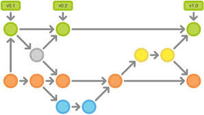

class: center, middle, inverse

# Devbox
.footnote[Brought to you by  D. <b><u>Duportal</u></b> and J-M <b><u>Meessen</u></b>]

---

# Agenda

1. Introduction

  - De quoi allons nous parler ?
  - Qui sommes nous ?
  - Qui êtes vous ?

2. Un peu de théorie ...

3. Des démos ...

???
(jmm)
---
layout: false
class: center, middle, inverse

# Introduction

???
(jmm)
---
layout: false
.left-column[
# Intro
  ## Qui sommes-nous ?
]
.right-column[

# Nous venons de Belgique

]
???
Jmm

---
layout: false
.left-column[
# Intro
  ## Qui sommes-nous ?
]
.right-column[

  # Nous venons de Belgique

  &nbsp;

  **Le pays du chocolat...**

.center[]

]
???
Jmm

---
layout: false
.left-column[
# Intro
  ## Qui sommes-nous ?
]
.right-column[

  # Nous venons de Belgique

  &nbsp;

  **Le pays de la bière...**

.center[]

]

???
Jmm

---
layout: false
.left-column[
# Intro
  ## Qui sommes-nous ?
]
.right-column[

  # Nous venons de Belgique

  &nbsp;

  **Le pays où on ne se prend pas (trop) au sérieux...**

.center[]

]
???
Jmm

---
layout: false
.left-column[
# Intro
  ## Qui sommes-nous ?
]
.right-column[

  # Nous venons de Belgique

  &nbsp;

  **Le pays où on tourne en rond ?**

.center[]

]
???
Jmm
---
layout: false
.left-column[
# Intro
  ## Qui sommes-nous ?
]
.right-column[
  # Jean-Marc MEESSEN

  Vous pourriez  me retrouver dans un surgelateur de grande surface

  .center[]

  * Senior developer @ Worldline, newcomer coach, development infrastructure

  * Developement Middleware sur Fuse / ServiceMix / Camel

  * Trop timide pour participer activement à des projets Open Source. Quelques contributions à Asciidoctor et Freeplane.

  * `jean-marc@meessen-web.org`, `@JM_Meessen`

]

???
jmm

---

layout: false
.left-column[
# Intro
  ## Qui sommes-nous ?
]
.right-column[
  # Damien DUPORTAL
]

???
Damien

---
layout: false
.left-column[
# Intro
  ## Qui sommes-nous ?
  ## Remerciements
]
.right-column[
  # Merci !

  * Organisateurs et bénévoles Mix-It 

  * à vous, de venir !

  * Aux personnes ayant réalisé et crus en ces outils
]

???
Damien

---
layout: false
.left-column[
# Intro
  ## Qui sommes-nous ?
  ## Remerciements
  ## Et vous ?
]
.right-column[
  # Faisons connaissance...

  * Des devs ? Des Ops ? Des chefs ? Autre ?

  * Des seniors (des vrais) ? Des moins seniors ? Des juniors ?

  * Expérience avec la virtualisation ?

  * Vous souvenez-vous de votre premier emploi ?
]

???
(jmm)
---
layout: false
.left-column[
# Pourquoi ce talk ?
]
.right-column[
  # Pourquoi ce talk ?
  * J'ai participé à beaucoup d'aventures ces 30 dernières années.

  * Toujours aussi enthousiaste pour apprendre et partager
  
  * MAIS, une de mes grandes frustrations : La perte de temps et d'énergie au démarrage de chaque nouvelle aventure.
]
???
jmm

"30 dernieres années" : 
  * aventures informatiques
  * au moins pour Jmm
  * beaucoup de belles victoires, des échecs...
  * des "jerks", mais surtout des gens géniaux

## enthousiastes
* admiratif des choses extraordinaires qu'il y "là dehors" 
* rendre la vie des gens plus facile et agréable
* Je suis fier de ce que je fais et je veux le partager (ex: new comers)
* J'espère pouvoir continuer à être enthousiaste et partageur au dela de ma penssion

---
layout: false
.left-column[
# Pourquoi ce talk ?
  ## Quel est le problème ?
]
.right-column[
  # Quel est le problème ? **FIXME**
  * Souvent un gaspillage d'énergies (à un moment de très haute motivation)
  * La mise en place de l'environement prend beaucoup de temps
    * Demarrage en trombe, mais dans les graviers...

  .left[]

  * ~~Nivellement par le bas~~
  * très rapide à déployer et du premier coup
  * coût de maintenance
]

???
  jmm

  * perte du focus
  
  * et je ne parle pas de l'env d'integration

  * Maintenance d'un environnement de dévelopement == douleur
    * "Just In Time" : c'est au moment des "onboardings" qu'on a découvre les problèmes, comportement homogène dans le temps

    * Maintenance et maJ : montée de version  de IDE / JDK / etc.
    * Coût : comment le mesurer pour l'anticiper voire le diminuer 

---
layout: false
.left-column[
# Pourquoi ce talk ?
  ## Quel est le problème ?
  ## Solutions ?
]
.right-column[
  # Solutions "d'avant"

  * les terminaux sur le mainframe

  * les PC avec images (quid des utilisateurs nomades ?)

  * virtualisation avec Vagrant/VB par ex

]

???
jmm

---
layout: false
.left-column[
# Pourquoi ce talk ?
  ## Quel est le problème ?
  ## Solutions ?
  ## Constat
]
.right-column[
  # Constat
  * DEVBOX = TOOLBOX = Trousse à outils = Camion atelier

  .left[]
  * même problèmes, donc mêmes solutions ...
    * DaaT : Devbox as a Tool (comme avant)
    * DaaS : Devbox as a Software
    * DaaI : Devbox as an Infrastructure
    * DaaLt :Devbox as a Learning tool
]

???
jmm

---
layout: false
.left-column[
# Pourquoi ce talk ?
  ## Quel est le problème ?
  ## Solutions ?
  ## Constat
  ## Docker !
]
.right-column[
  # Docker !

  * Docker résouds le pb de "Matrix of hell"
  * Docker contractualise
  * Docker est rapide
  * Docker est "à la mode"
  * Permet de nouveaux produits/solutions
    * Souvenez vous de la "libération" du GPS par B. Clinton

]
???
(jmm)
---

template: inverse

# Utiliser les recettes de l'ingénierie logicielle 
## Nous sommes TOUS des ingénieurs "Full stack"

---
layout: false
.left-column[
# "Full stack" Engineer
  ## Code == Valeur

]
.right-column[
  # "La vérité est dans le code"
  (http://programming-motherfucker.com)

  Utilisez des SCMs, préférerrez des décentralisés qui ouvre la voie à de nouvelles façons de travailler :

  FIXME : Image du graph Github pour *Github wokflow*
  OK ?

  .center[]
]

---
layout: false
.left-column[
# "Full stack" Engineer
  ## Code == Valeur
  ## Nouvelles pratiques

]
.right-column[
  # "Nouvelles" pratiques

  N'ayons pas peur d'_essayer,_ **plusieurs fois,** toutes ces nouvelles façons de faire, sans être dogmatiques

  * Agile
  * TDD/BDD/Doc. as code
  * DevOps
]

---
layout: false
.left-column[
# "Full stack" Engineer
  ## Code == Valeur
  ## Nouvelles pratiques
  ## Continous*
]
.right-column[
  # Continous*

  * Continous Integration
  * Continuous Testing (TDD right ?)
  * Cotinuous documentation
  * Continuous Benchmarking
  * Continuous delivery
 
]

---
layout: false
.left-column[
# "Full stack" Engineer
  ## Code == Valeur
  ## Nouvelles pratiques
  ## Continous*
  ## "Human Stack"
]
.right-column[

# "Human stack" : culture 
* (continuous and linear learning, trust, transparency, droit à l'erreur)
* Compagnonage (on fabrique ses propres outils comme partie de l'apprentissage)
* Eat your own dog food

 
]

---
template: inverse

# Démo Time !

???
jmm
---
layout: false
.left-column[
# Démo Time !
]
.right-column[
  # Démo Time !

  * Contexte : spring boot "hello world" application
  * Java DK, Maven, IntelliJ Idea, Docker, Compose
  * https://github.com/jmMeessen/devbox
  * Use cases :
    * Onboarding
    * Developement simple basé sur Spring Boot
    * MaJ IDEA sans casser le dev workflow
    * Portabilité
    * ? Legacy (reprendre old applications)
]
???
jmm

---
layout: false
.left-column[
# Démo Time !
  ## Devbox as a code
]
.right-column[
  # SCM :Git (on Github)

  * Public
  * Partagé
  * Pull-Request systématique (Github workflow)
 
]
???
jmm

---
layout: false
.left-column[
# Démo Time !
  ## Devbox as a code
]
.right-column[
  # TDD/BDD

  Utilisation de [bats](https://github.com/sstephenson/bats) au maximum
  * BDD oriented :
FIXME : code example d'un test
  * Bash based : compromis "bootstrap rapide" vs. maintenabilité
  * Objectif pour une PR : test, puis impl à chaque fois !
  * Pragamtisme : ne pas tout tester non plus, par petits pas !
 
]
???
jmm

---
layout: false
.left-column[
# Démo Time !
  ## Devbox as a code
]
.right-column[
  # Continuous*

  Utilisation de [CircleCI](https://circleci.com) :
  * Github-hook based (push == build)
  * Support de Docker
  * Configuration as a code
FIXME : extrai de circle.yml
 
]
???
jmm

---
layout: false
.left-column[
# Démo Time !
  ## Devbox as a code
]
.right-column[
  # Docker stack

  Utilisation de [boot2docker](https://boot2docker.io) :
  * Mutli-plateforme (virtualbox)
  * Support officiel de Docker
 
]
???
jmm

---
layout: false
.left-column[
# Démo Time !
  ## Devbox as a code
]
.right-column[
  # Cinématique

  Utilisation de [GNU Make](https://www.gnu.org/software/make/) :
  * Indépendance cinémtique / outils (passage à packer ou rocket ?)
  * Multi-platforme
 
]
???
jmm

---
layout: false
.left-column[
# Démo Time !
  ## Devbox as a code
]
.right-column[
  # Demo 1 : 

  FIXME : schema global
 
]
???
jmm

---
template: inverse

# Demo 1

???
jmm

---
layout: false
.left-column[
# Démo Time !
  ## Devbox as a code
  ## Devbox as an infrastructure
]
.right-column[

# Données

  * Comment conserver ses données si on détruit/met à jour la VM ?
  * Comment sauvegarder ses données ?

# Réseau 

  * Travailleurs nomades, pauvres employé de SSI...
  * Ressources locales : cache proxy, registre docker, cache Maven) ?
 
]

---
layout: false
.left-column[
# Démo Time !
  ## Devbox as a code
  ## Devbox as an infrastructure
]
.right-column[
  # Devbox as an infrastructure

  Solution : Docker-compose ! 

FIXME : docker.yml
 
]

---
layout: false
.left-column[
# Démo Time !
  ## Devbox as a code
  ## Devbox as an infrastructure
]
.right-column[
  # Demo 2 : 

  FIXME : schema global
 
]

---
template: inverse

# Demo 2

---
layout: false
.left-column[
# Conclusion
  ## Qu'à t'on appris ?
]
.right-column[
  # Qu'à t'on appris ?

 * j'ai appris de nouvelles technos (amélioré ma pratique)
  * Docker
  * Test Driven SYSTEM development (DEVOPS) 
  * Bash and Linux skills
  * the Gitlab/Github way
  * confirmation que de la conception à la production, le flux est continu (mort aux silos)
  * apprentissage du travail communautaire/ OSS (des valeurs qui me sont très proches) aussi à distance.

* Notre intuition est correcte:
  * Encore rien rencontré de bloquant et très, très prometteur.
  * Il y a encore du travail
  * j'attend avec impatience l'épreuve du feu (situation réelle)

]

---
layout: false
.left-column[
# Conclusion
  ## Qu'à t'on appris ?
  ## Le bon et le moins bon
]
.right-column[

# Pas cool
* GUI : des difficultés et bugs bizarre
* Adhésion et motivation nécessaires

# Cool
* Performances 
* CLI : parfait
* Excellent indicateur de la culture de vos devs.

# Améliorations
* Processus de release rigoureux avec le DockerHub
* Plus d'automatisation (x2go commande line)
* README à améliorer (contributions ? )
]

---
template: inverse

# The end
## Thanks ! Questions ?
